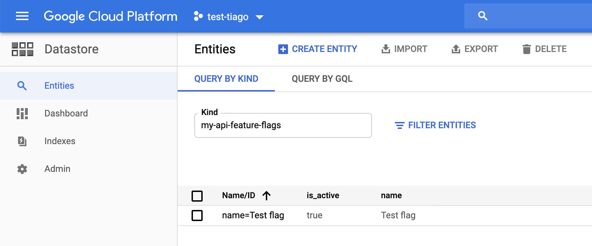

# datastore-feature-flags

A small toolkit that enable any Golang project to use Datastore entities (https://cloud.google.com/datastore/) as a simple feature flags mechanism (https://en.wikipedia.org/wiki/Feature_toggle).

## Prerequisites
- [A Google Cloud Platform project](https://cloud.google.com/resource-manager/docs/creating-managing-projects) and a [service account](https://cloud.google.com/iam/docs/creating-managing-service-accounts) for it
- [A service account key (as JSON)](https://cloud.google.com/iam/docs/creating-managing-service-account-keys) for the service account and [GOOGLE_APPLICATION_CREDENTIALS](https://cloud.google.com/docs/authentication/getting-started?hl=en#setting_the_environment_variable) environment variable with its path
- [A Google Cloud Datastore instance](https://cloud.google.com/datastore/docs/quickstart) in [Datastore Mode](https://cloud.google.com/datastore/docs/quickstart?hl=en#firestore-or-datastore)
- For unit testing:
    - a Java 8+ JRE must be installed and on your system PATH
    - [Google Cloud SDK](https://cloud.google.com/sdk/install)
    - [Google Cloud SDK Datastore Emulator](https://cloud.google.com/datastore/docs/tools/datastore-emulator)

## Basic usage

Given the following entity on GCP Datastore:



This is a sample code to retrieve it:

```
package main

import (
	"context"
	"log"

	"github.com/tiagomelo/datastore-feature-flags"
)

func main() {
	ctx := context.Background()

	store, err := datastore.NewStore(ctx, "my-api-feature-flags")
	if err != nil {
		log.Fatal(err, "unable to init database")
	}

	featureFlag, err := store.GetFeatureFlagByName(ctx, "Test flag")
	if err != nil {
		// proper error handling
	}

	if featureFlag.IsActive {
		// ...
	}
}
```

## Unit testing

```
$ make test
```
